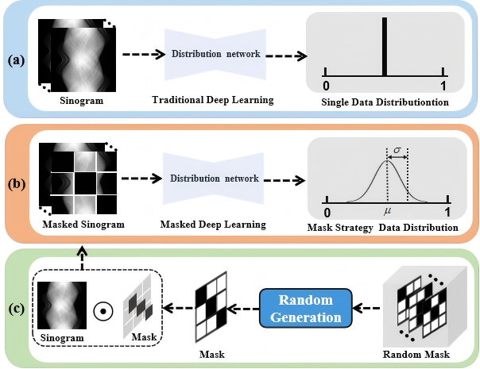
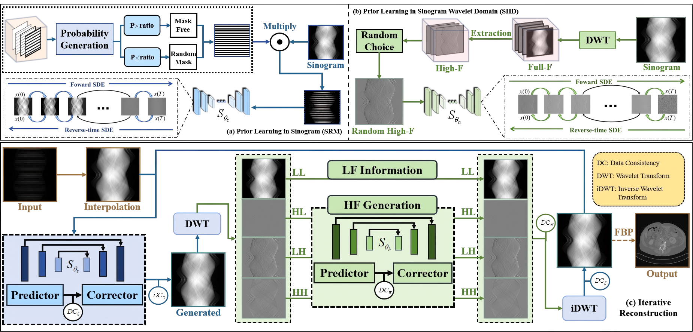
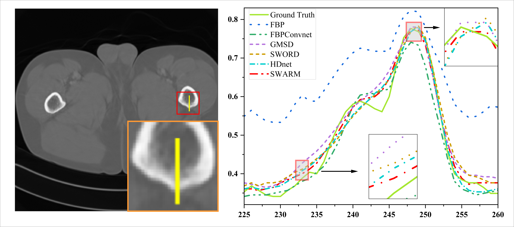

# Physics-informed DeepCT: Sinogram Wavelet Decomposition Meets Masked Diffusion (SWARM)
[](https://arxiv.org/abs/2501.09935)
[](https://opensource.org/licenses/MIT)
This repository contains the official implementation of the paper **"Physics-informed DeepCT: Sinogram Wavelet Decomposition Meets Masked Diffusion"**.

**Note:** The source code is available at [https://github.com/yqx7150/SWARM](https://github.com/yqx7150/SWARM).

## Abstract
Abstract— Diffusion models have demonstrated strong potential in sparse-view computed tomography (SVCT) reconstruction. However, their generalization ability is often constrained when trained on limited sample spaces, leading to performance degradation when encountering unseen data. This typically leads to image blurring, loss of structural details, and cross-region inconsistencies. To address these challenges, we propose a Sinogram-based Wavelet random decomposition And Random mask diffusion Model (SWARM) for SVCT reconstruction. Specifically, introducing a random mask strategy in the sinogram effectively expands the limited training sample space. This enables the model to learn a broader range of data distributions, enhancing its understanding and generalization of data uncertainty. In addition, we designed a wavelet-based random training mechanism for sinogram high-frequency components, enabling the model to capture structural details in different frequency bands and enhancing the richness and structural consistency of the representations. Two stage iterative reconstruction method is adopted to ensure the global consistency of the reconstructed image while refining the details. Compared with other state-of-the-art reconstruction methods, SWARM can increase the PSNR by 3.59 dB on average, the SSIM by 0.69%, and reduce the MSE by 55.40%. These experimental results indicate that SWARM has great potential in the field of sparse-view CT image reconstruction.

Index Terms— Sparse-view CT, random mask, sinogram wavelet decomposition, diffusion model.

## Methond Overview
<p align="center">
  
  <br>
  <em>Figure 1: Different training strategies and influence of sinogram in deep learning. (a) Distribution of training data in a closed data space; (b) The distribution of the data obtained through the mask extension method in the extended data space; (c) The generation process of the random mask and how it is embedded in the data..</em>
</p>

<p align="center">
  
  <br>
  <em>Figure 2: The pipeline of SWARM training process and iterative reconstruction procedure. Training stage: (a) A model training based on random masks in sinogram. (b) A model training for high-frequency random decomposition of wavelet based on sinogram. Iteration reconstruction stage: (c)The proposed SWARM method is used to reconstruct the sparse-view CT projection domain. “LF”: Low-frequency. “HF”: High-frequency.</em>
</p>

## Results
<p align="center">
  
  <br>
  <em>Figure 3: Reconstruction images from 90 views using different methods with AAPM challenge data. (a) The reference image versus the images reconstructed by (b) FBP, (c) FBPConvNet, (d) HDNet, (e) GMSD, (f) SWORD, and (g) SWARM. The display window is [-480, 945] HU. The second line is the residual between the reference image and the reconstructed image.</em>
</p>

<p align="center">
  
  <br>
  <em>Figure 4:Reconstruction images from 60 views using different methods with CIRS phantom data. (a) The reference image versus the images reconstructed by (b) FBP, (c) FBPConvNet, (d) HDNet, (e) GMSD, (f) SWORD, and (g) SWARM. The display window is [675, 1300] HU. The second line is the residual between the reference image and the reconstructed image.</em>
</p>

<p align="center">
  
  <br>
  <em>Figure 5: Reconstruction images from 60 views using different methods with Dental Arch data. (a) The reference image versus the images reconstructed by (b) FBP, (c) FBPConvNet, (d) HDNet, (e) GMSD, (f) SWORD, and (g) SWARM. The display window is [-60, 1300] HU. The second line is the residual between the reference image and the reconstructed image.</em>
</p>

<p align="center">
  
  <br>
  <em>Figure 6: Reconstruction images from 90 views using different methods with Dental Arch data. (a) The reference image versus the images reconstructed by (b) FBP, (c) FBPConvNet, (d) HDNet, (e) GMSD, (f) SWORD, and (g) SWARM. The display window is [-500, 970] HU. The second line is the residual between the reference image and the reconstructed image.</em>
</p>

<p align="center">
  
  <br>
  <em>Figure 7: The intensity profiles of different methods along the specified yellow line in an example reconstructed image.</em>
</p>


## Citation
```bibtex
If you find this work useful, please cite our paper:
@article{zhou2025swarm,
  title={Physics-informed DeepCT: Sinogram Wavelet Decomposition Meets Masked Diffusion},
  author={Zhou, Zekun and Liu, Tan and Yu, Bing and Gong, Yanru and Tao, Xi and Shi, Liu and Liu, Qiegen},
  journal={arXiv preprint arXiv:2501.09935},
  year={2025}
}
